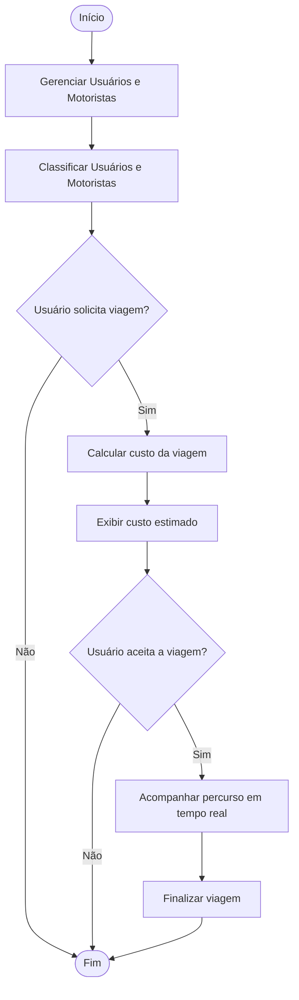
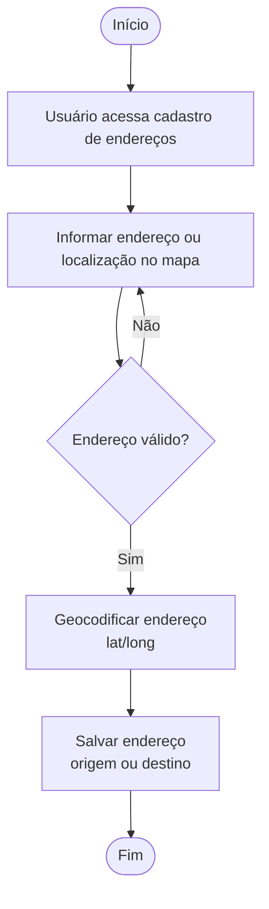
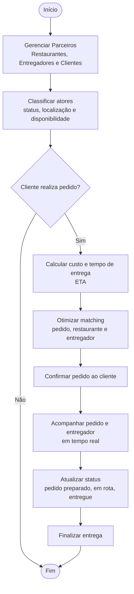
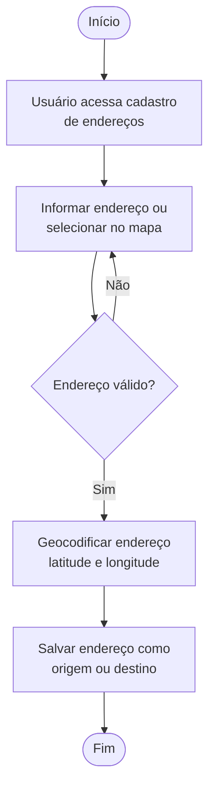
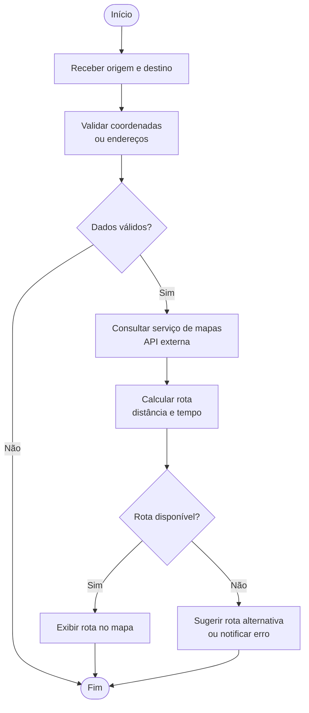
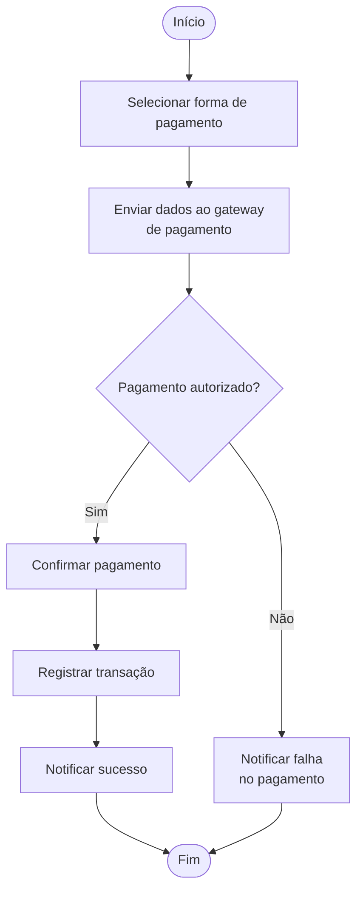

# **ATIVIDADE: APLICANDO DDD**

## Serviço de Transporte de Passageiros com Veículos de Passeio

O Domínio Central (*Core Domain*) de uma plataforma de **Transporte Automotivo** como o Uber é focado nos conceitos que representam a **iniciativa estratégica chave** da organização, gerando diferencial competitivo.

Com base nos princípios do *Domain-Driven Design* (DDD) e nos conceitos do domínio de **Transporte Automotivo**, o Domínio Central do Uber envolveria primariamente os seguintes conceitos:

1.  **Base confiável e classificada de Motoristas e Usuários:** Gerenciar e categorizar os atores principais da plataforma, o que é fundamental para a operação e para a qualidade do serviço.
2.  **Políticas para Cálculo e Previsão de Custos de Viagem:** O algoritmo para calcular tarifas, que muitas vezes é dinâmico (tarifa de surto ou *surge pricing*) e depende de variáveis complexas para determinar o preço e a estimativa de custo para o usuário.
3.  **Acompanhamento de Percursos:** Rastrear a jornada em tempo real e gerenciar o fluxo de trabalho da viagem (do aceite ao término), que é o serviço fundamental da plataforma.

Esses elementos são considerados centrais porque diferenciam o serviço no mercado e contêm a **lógica de negócios** mais valiosa e especializada.

### **Fluxograma da Plataforma de Transporte (Domínio Central)**

## Subdomínios Genéricos (Apoio)

Embora essenciais para a operação da plataforma, existem outros elementos que seriam considerados de **apoio** (Subdomínios Genéricos) e não fariam parte do Domínio Central:

### **Cadastro de Endereços/Localização de Origem e Destino**

### **Traçar Rotas e Mapas (serviços de mapeamento e roteamento)**

### **Processar Pagamentos (integração com sistemas de pagamento e cobrança)**

Essas funcionalidades de apoio acrescentam complexidade ao sistema, mas o conhecimento envolvido (por exemplo, como traçar uma rota ou processar um cartão de crédito) não é o **conhecimento especializado** que fornece a vantagem estratégica do negócio. A abordagem do DDD é focar o **talento superior** no **Domínio Principal** e evitar gastar o mesmo esforço em subdomínios genéricos.

> Em resumo, a essência do negócio do Uber estaria na conexão eficiente e inteligente entre usuários e motoristas e na definição de preços, enquanto os serviços de mapeamento, gestão de usuários e pagamentos seriam considerados genéricos ou de suporte. A plataforma utiliza essa segregação, conforme indicado pela referência a "Uber: Introducing Domain-Oriented Microservice Architecture".

Os elementos do Domínio Central de uma empresa de Transporte Automotivo estão intrinsecamente ligados aos domínios em seu entorno, pois dependem dos serviços e dados desses subdomínios de apoio (ou Subdomínios Genéricos) para cumprir suas funções estratégicas,.

Os elementos centrais (Domínio Principal), focados nos diferenciais competitivos do negócio, acessam os elementos de apoio para realizar operações essenciais que não são sua motivação principal,.

1.  **Base confiável e classificada de Motoristas e Usuários (Domínio Central)**
    *   Este elemento precisa se ligar ao **Processar Pagamentos** (domínio de apoio) para receber pagamentos de usuários e gerenciar repasses a motoristas.
    *   Também precisa se ligar a elementos de **Endereços/Localização** (domínio de apoio) para saber onde os usuários e motoristas estão e para onde se destinam.

2.  **Políticas para Cálculo e Previsão de Custos de Viagem (Domínio Central)**
    *   Este elemento depende da funcionalidade de **Traçar Rotas e Mapas** (domínio de apoio) para calcular a distância percorrida, o tempo estimado e as condições de tráfego, fatores essenciais para a estimativa de custos.
    *   O resultado da previsão de custos precisa se integrar ao **Processar Pagamentos** (domínio de apoio) para efetivar a cobrança.

3.  **Acompanhamento de Percursos (Domínio Central)**
    *   Este elemento requer informações contínuas de **Endereços/Localização** (domínio de apoio) para rastrear o veículo em tempo real.
    *   Também se baseia no **Traçar Rotas e Mapas** (domínio de apoio) para verificar se o veículo está seguindo a rota planejada e para calcular o tempo restante.

No Design Orientado pelo Domínio (DDD), o esforço estratégico é reservado para o **Domínio Central** (Domínio Principal), enquanto os **Subdomínios Genéricos** (como processamento de pagamentos ou mapeamento de rotas) são separados em módulos distintos, que fornecem serviços de suporte ao Core, frequentemente utilizando soluções prontas (off-the-shelf).

> **É possível identificar termos comuns a mais de um domínio com significados distintos**, e este é um desafio central abordado pelo *Domain-Driven Design* (DDD).
> A essência do DDD reconhece que, em sistemas complexos ou em organizações multifuncionais, surgem ambiguidades linguísticas quando termos idênticos possuem significados divergentes em diferentes partes do negócio.
>
> ### O Conceito de Contexto
>
> No DDD, o princípio fundamental é que **"o contexto é rei"** (*context is king*), pois o significado de uma palavra ou modelo só pode ser compreendido em um determinado contexto.
> Se essa ambiguidade linguística não for gerenciada, o software pode se tornar caótico e desorganizado, resultando em uma "Grande Bola de Lama" (*Big Ball of Mud*), um antipadrão onde o sistema se torna difícil de entender, manter e evoluir.
Em resumo, a essência do negócio do Uber estaria na conexão eficiente e inteligente entre usuários e motoristas e na definição de preços, enquanto os serviços de mapeamento, gestão de usuários e pagamentos seriam considerados genéricos ou de suporte. A plataforma utiliza essa segregação, conforme indicado pela referência a "Uber: Introducing Domain-Oriented Microservice Architecture".

## Sistema de entrega de comida

O Domínio Principal (**Domínio Central** ou *Core Domain*) de uma empresa como o iFood, no setor de Serviço de Entrega de Comidas, seria focado nas atividades que constituem sua **iniciativa estratégica chave** e que geram seu **diferencial competitivo**.

Com base nos princípios do *Domain-Driven Design* (DDD), o Domínio Central concentra-se em resolver problemas de **alta complexidade** e **volatilidade** (aqueles que exigem inovação contínua). É aqui que o talento superior da equipe deve ser aplicado para encontrar um modelo profundo e flexível.

Seguindo a lógica aplicada ao segmento de Transporte Automotivo (como a Uber), o Domínio Central do iFood envolveria a orquestração de toda a cadeia de valor da entrega, focando nos elementos que a diferenciam da concorrência:

*   **Gestão de Relacionamento e Logística (Entregadores, Clientes e Restaurantes):** O estabelecimento de uma base confiável e classificada de Parceiros (Restaurantes), Entregadores e Usuários.
*   **Políticas para Cálculo e Otimização de Viagem:** O cálculo e a previsão de custos e, crucialmente, de **tempo de entrega** (ETA) de forma eficiente, otimizando o *matching* (combinação) entre pedidos, restaurantes e entregadores disponíveis. As políticas de cálculo e previsão de custos de viagem são citadas como parte do Domínio Central de empresas de transporte.
*   **Acompanhamento de Pedidos e Entregadores:** O rastreamento em tempo real dos percursos e do status de cada pedido.

Em contrapartida, subdomínios que são essenciais para a operação, mas não oferecem um diferencial competitivo exclusivo, são considerados **Domínios Genéricos** ou **de Suporte** e, frequentemente, são atendidos por soluções prontas ou terceirizadas.

Para um serviço de entrega de comidas, os seguintes elementos seriam considerados domínios de apoio:

## **cadastro de Endereços/Localização de Origem e Destino**

## **Traçar Rotas e Mapas (geralmente integrando-se com serviços de mapeamento existentes)**

## **Processar Pagamentos (geralmente resolvido por um sistema genérico)**

O iFood é citado como um exemplo de sucesso na aplicação de uma arquitetura orientada a eventos para modernizar seu *middleware financeiro*, o que sugere que, embora o domínio financeiro não seja o núcleo (Core), ele é importante o suficiente para exigir uma arquitetura robusta.

Os elementos do Domínio Central (Core Domain) de um Serviço de Entrega de Comidas, assim como em qualquer arquitetura orientada a domínio, estão necessariamente ligados aos domínios em seu entorno para a execução das funcionalidades essenciais, mas que não são o foco estratégico do negócio,
O DDD busca que o **Domínio Principal** (que contém o diferencial competitivo) mantenha-se isolado e focado na lógica de negócio mais complexa, delegando o trabalho de suporte a **Subdomínios Genéricos** (como processamento de pagamentos ou mapeamento de rotas), que são vistos como serviços de apoio.

### 1. Base confiável e classificada de Motoristas e Usuários (Domínio Central)

Este elemento central, focado na gestão de relacionamento e logística, requer a colaboração dos seguintes domínios de entorno para a funcionalidade básica:

*   **Processar Pagamentos:** É essencial para lidar com as transações financeiras, seja para cobrar clientes ou para remunerar motoristas e restaurantes.
*   **Cadastro de Endereços/Localização:** Precisa acessar este domínio para saber onde os usuários e parceiros (motoristas e restaurantes) estão localizados e para onde se dirigem.

### 2. Políticas para Cálculo e Previsão de Custos de Viagem (Domínio Central)

Este é um subdomínio estratégico, responsável pela otimização e precificação do serviço. Ele depende diretamente de:

*   **Traçar Rotas e Mapas:** Requer dados de rotas e distâncias para realizar cálculos precisos de custos e, principalmente, do **Tempo Estimado de Chegada (ETA)**, que é crucial para o serviço.
*   **Processar Pagamentos:** O resultado do cálculo de custos é o valor que precisa ser repassado ao sistema de pagamentos para efetivar a cobrança.

### 3. Acompanhamento de Percursos (Domínio Central)

O rastreamento em tempo real dos entregadores e do status do pedido se baseia fundamentalmente em informações geográficas:

*   **Traçar Rotas e Mapas:** Utiliza este domínio para visualizar o percurso do entregador e projetar o tempo restante de entrega, fornecendo o *status* do pedido ao cliente.
*   **Cadastro de Endereços/Localização:** É essencial para receber as coordenadas de GPS em tempo real e compará-las com os pontos de origem e destino.

Em essência, a arquitetura é construída de forma que o **Domínio Principal** (a inteligência de negócio sobre pedidos, parceiros e otimização) é isolado, mas invoca os **Domínios Genéricos** (a infraestrutura de localização, mapas e finanças) para tarefas de suporte.

>A necessidade de gerenciar essa ambiguidade linguística se deve ao princípio fundamental do DDD de que **"o contexto é rei"**, pois o significado de uma palavra ou modelo só pode ser entendido dentro de seu ambiente específico.

>### Resolução de Ambiguidade no DDD
>
A presença de um mesmo termo com significados divergentes em diferentes partes de um sistema é comum e, se não for resolvida, pode levar a um sistema caótico e desorganizado, frequentemente referido como uma **"Grande Bola de Lama"**.
>
>Para lidar com essa complexidade, o DDD define:
>
>1.  **Contextos Delimitados** (*Bounded Contexts*): São limites explícitos que separam reinos distintos de entendimento dentro de um sistema, estabelecendo fronteiras conceituais que ditam interpretações específicas para os termos,,.
>2.  **Linguagem Ubíqua** (*Ubiquitous Language*): É o vocabulário consistente e compartilhado que se mantém estritamente coerente **apenas dentro** de seu Contexto Delimitado,,.
>
>A identificação de um termo com significados diferentes em áreas distintas é, na verdade, uma estratégia crucial para **detectar e desenhar as fronteiras** desses Contextos Delimitados.
>Ao delimitar os contextos, o DDD atribui significados limitados e válidos para o termo em cada âmbito particular, garantindo que cada modelo seja útil para seu propósito específico.

