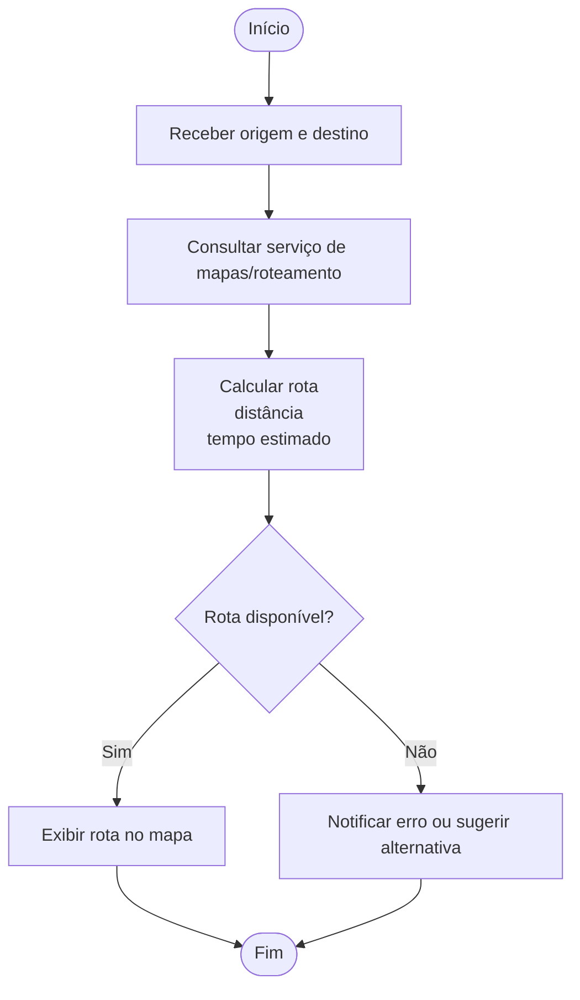
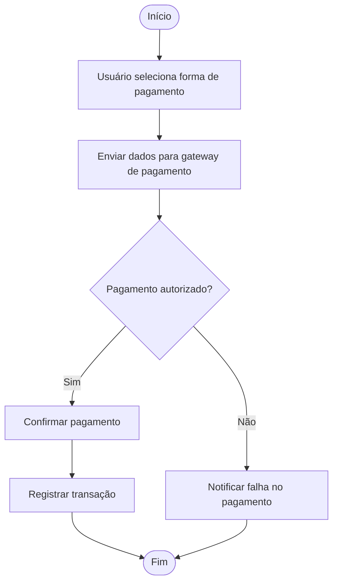

# **ATIVIDADE: APLICANDO DDD**

O Domínio Central (*Core Domain*) de uma plataforma de **Transporte Automotivo** como o Uber (serviço de Transporte de Passageiros com Veículos de Passeio) é focado nos conceitos que representam a **iniciativa estratégica chave** da organização, gerando diferencial competitivo.

Com base nos princípios do *Domain-Driven Design* (DDD) e nos conceitos do domínio de **Transporte Automotivo**, o Domínio Central do Uber envolveria primariamente os seguintes conceitos:

1.  **Base confiável e classificada de Motoristas e Usuários:** Gerenciar e categorizar os atores principais da plataforma, o que é fundamental para a operação e para a qualidade do serviço.
2.  **Políticas para Cálculo e Previsão de Custos de Viagem:** O algoritmo para calcular tarifas, que muitas vezes é dinâmico (tarifa de surto ou *surge pricing*) e depende de variáveis complexas para determinar o preço e a estimativa de custo para o usuário.
3.  **Acompanhamento de Percursos:** Rastrear a jornada em tempo real e gerenciar o fluxo de trabalho da viagem (do aceite ao término), que é o serviço fundamental da plataforma.

Esses elementos são considerados centrais porque diferenciam o serviço no mercado e contêm a **lógica de negócios** mais valiosa e especializada.

# **Fluxograma da Plataforma de Transporte (Domínio Central)**

## Subdomínios Genéricos (Apoio)

Embora essenciais para a operação da plataforma, existem outros elementos que seriam considerados de **apoio** (Subdomínios Genéricos) e não fariam parte do Domínio Central:

### **Cadastro de Endereços/Localização de Origem e Destino**

### **Traçar Rotas e Mapas (serviços de mapeamento e roteamento)**

### **Processar Pagamentos (integração com sistemas de pagamento e cobrança)**

Essas funcionalidades de apoio acrescentam complexidade ao sistema, mas o conhecimento envolvido (por exemplo, como traçar uma rota ou processar um cartão de crédito) não é o **conhecimento especializado** que fornece a vantagem estratégica do negócio. A abordagem do DDD é focar o **talento superior** no **Domínio Principal** e evitar gastar o mesmo esforço em subdomínios genéricos.

Em resumo, a essência do negócio do Uber estaria na conexão eficiente e inteligente entre usuários e motoristas e na definição de preços, enquanto os serviços de mapeamento, gestão de usuários e pagamentos seriam considerados genéricos ou de suporte. A plataforma utiliza essa segregação, conforme indicado pela referência a "Uber: Introducing Domain-Oriented Microservice Architecture".
