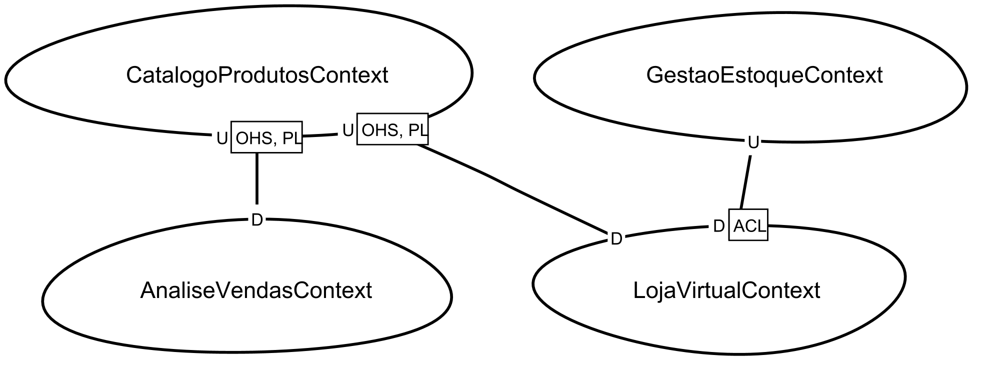
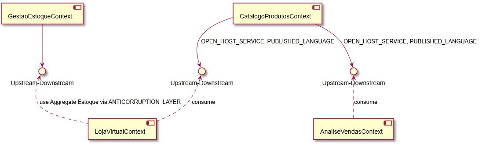

# ATIVIDADE: ACL, OHS E PL (2)

## 1. Solução Estruturada

### Resposta à Pergunta 2: Exposição do Catálogo de Produtos

Para que o **Catálogo de Produtos** atenda à Loja Virtual e à Análise de Vendas sem criar um acoplamento excessivo ou múltiplas interfaces customizadas, ele deve implementar:

* **OHS (Open Host Service):** O Catálogo define um protocolo de acesso público (ex: uma API REST ou gRPC) que qualquer interessado pode consumir.
* **PL (Published Language):** O Catálogo utiliza um modelo de dados comum e bem documentado (como JSON ou XML com um esquema definido) para que os outros contextos entendam as informações de preço e categoria de forma padronizada.

### Resposta à Pergunta 3: Proteção contra o Sistema Legado

A **Loja Virtual** precisa interagir com a **Gestão de Estoque**, que possui um modelo "ultrapassado e complexo". Para evitar que essa complexidade "corrompa" o código limpo da Loja, utiliza-se:

* **ACL (Anticorruption Layer):** A Loja cria uma camada isolada que traduz as requisições do seu modelo moderno para o modelo complexo do legado. Assim, se o sistema de estoque mudar ou for substituído, apenas a ACL precisará de ajustes, mantendo a lógica da Loja intacta.

---

## 2. Plano de Aplicação dos Padrões

| Integração | Padrão Utilizado | Justificativa |
| --- | --- | --- |
| **Catálogo** $\rightarrow$ **Loja/Análise** | **OHS + PL** | Garante escalabilidade. O Catálogo não precisa mudar sempre que um novo consumidor surgir. |
| **Loja** $\rightarrow$ **Estoque** | **ACL** | Protege o novo sistema (Loja) da "sujeira" técnica e complexidade do sistema legado. |

---

## 3. Diagrama Conceitual (Documentação)

Abaixo, descrevo a topologia do diagrama para sua implementação:

1. **Núcleo Central:** O contexto **Catálogo de Produtos** expõe uma interface **OHS** usando uma **PL** (ex: `ProductDTO`).
2. **Consumidores de Catálogo:** A **Loja Virtual** e a **Análise de Vendas** conectam-se diretamente a essa interface OHS.
3. **Barreira de Proteção:** Entre a **Loja Virtual** e a **Gestão de Estoque**, desenha-se um bloco intermediário rotulado como **ACL**.
4. **Fluxo de Dados:**
* Loja solicita estoque $\rightarrow$ ACL traduz $\rightarrow$ Legado processa.
* Legado responde $\rightarrow$ ACL limpa os dados $\rightarrow$ Loja recebe modelo limpo.

---

### Pontos-Chave da Aplicação

* **Autonomia:** Cada equipe pode evoluir seu contexto sem quebrar os outros, desde que a **PL** (linguagem publicada) seja respeitada.
* **Resiliência:** A **ACL** evita que o "débito técnico" do estoque legado vaze para as novas funcionalidades da loja.
* **Padronização:** O uso de **OHS** simplifica a governança de dados, centralizando a verdade sobre os produtos.

**Diagrama de contexto da Loja Virtual**

**Diagrama UML da loja virtual**

