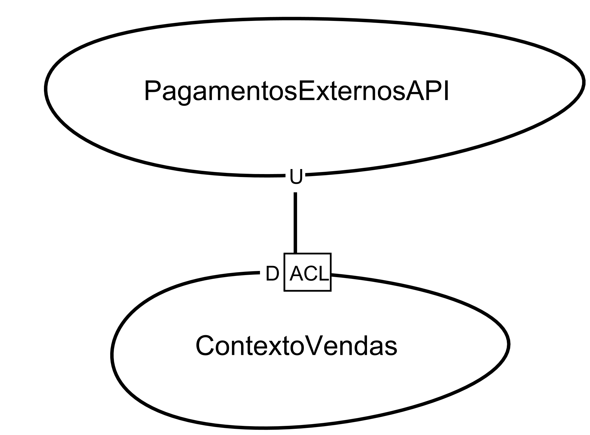

# ATIVIDADE: CF E ACL (2)

## 1. Qual é a principal diferença entre os padrões Conformista e Camada Anticorrupção?

A diferença reside na **autonomia do modelo de domínio** do contexto que recebe os dados (Downstream):

* **Conformista (CF):** O time *Downstream* toma a decisão consciente de não criar seu próprio modelo. Eles aceitam o modelo do fornecedor (*Upstream*) "como ele é". Se o fornecedor mudar um nome de campo ou uma regra, o *Downstream* muda também. Não há tradução.
* **Camada Anticorrupção (ACL):** O time *Downstream* cria uma camada intermediária que traduz o modelo do fornecedor para o seu próprio modelo ideal. Isso isola o domínio interno de conceitos externos, garantindo que o sistema não seja "poluído" por designs ruins ou legados de terceiros.

---

## 2. Em que situações você acha que seria benéfico usar cada um desses padrões?

### Usar Conformista quando:

* O modelo do fornecedor é um padrão de mercado (ex: protocolos bancários padrão).
* A equipe *Downstream* não tem recursos para manter uma camada de tradução complexa.
* O fornecedor é extremamente estável e seu design é considerado de alta qualidade.

### Usar Camada Anticorrupção (ACL) quando:

* Você está integrando com um **Sistema Legado** que possui um modelo confuso ou obsoleto.
* O seu domínio é o núcleo do seu negócio e precisa de proteção máxima contra mudanças externas.
* Diferentes fornecedores de uma mesma API precisam ser normalizados para um único formato interno.

---

## 3. Quais são os benefícios e os riscos associados a cada um desses padrões?

| Padrão | Benefícios | Riscos |
| --- | --- | --- |
| **Conformista** | Baixo custo inicial; integração rápida e simples; sem sobrecarga de tradução. | Total dependência do fornecedor; se o fornecedor errar no design, você herda o erro. |
| **ACL** | Isolamento total; autonomia para evoluir o modelo interno; proteção contra mudanças externas. | Alto custo de desenvolvimento; latência adicional na tradução; complexidade de manutenção. |

---

## 4. Estudo de Caso: Integração com Sistema de Pagamentos

Para este cenário, a solução ideal é a **Camada Anticorrupção (ACL)**.

### Análise e Plano de Implementação:

Como o sistema de pagamentos externo é rígido e possui um modelo complexo, não queremos que os termos técnicos desse fornecedor se espalhem pelo nosso código de vendas.

**Exemplo de implementação em Context Mapper (.cml):**

```csharp
ContextMap EcommercePaymentMap {
    contains ContextoVendas
    contains PagamentosExternosAPI

    /* Vendas protege seu domínio com uma ACL */
    ContextoVendas [D, ACL]<-[U] PagamentosExternosAPI
}

BoundedContext ContextoVendas {
    /* Modelo ideal e limpo */
    Module checkout {
        Aggregate Pagamento {
            Entity Transacao {
                double valor
                String status
            }
        }
    }
}

BoundedContext PagamentosExternosAPI {
    /* Modelo complexo e rígido do fornecedor */
}

```



### Justificativa da Escolha:

Ao usar a **ACL**, se amanhã decidirmos trocar de fornecedor de pagamentos (ex: trocar Stripe por PayPal), precisaremos alterar apenas a camada de tradução (ACL). O coração do nosso sistema (Vendas) permanecerá intacto, pois ele nunca "conheceu" o modelo real do fornecedor, apenas a interface traduzida pela ACL.

---
