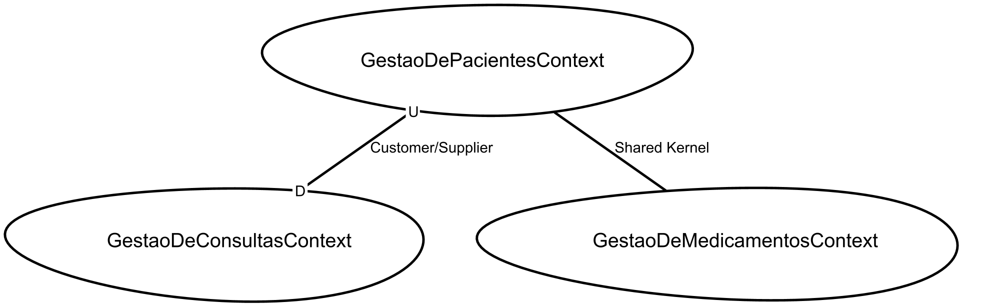
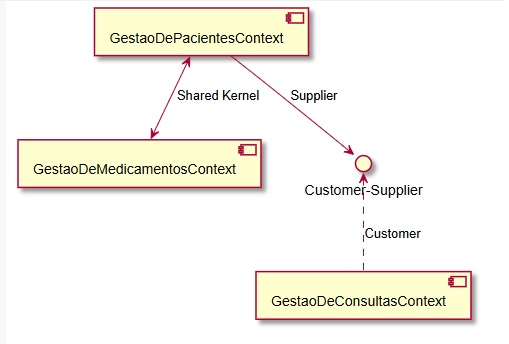

# ATIVIDADE: C/S, SW E SK (2)

## 1. Identificação do Subconjunto Comum (SK)

Para que a **Gestão de Pacientes** e a **Gestão de Medicamentos** interajam, elas precisam de uma linguagem comum sobre o que está sendo administrado e a quem.

* **O que compartilhar:** Um modelo de **Prescrição Médica** ou **Registro de Dispensação**.
* **Dados envolvidos:** ID do Paciente, ID do Medicamento, Dosagem, Data de Validade da Receita e Status de Entrega.
* **Por que um SK?** Ambos os contextos precisam ler e gravar nessas informações para garantir que o paciente certo receba o remédio correto, sem que um contexto precise "mandar" totalmente no outro.

---

## 2. Plano de Implementação do Shared Kernel (SK)

O Shared Kernel exige coordenação estreita entre as equipes, pois qualquer mudança no "núcleo" afeta ambos os lados.

1. **Definição do Escopo:** Identificar as classes (ex: `Prescription`, `Dosage`) e tabelas de banco de dados que serão compartilhadas.
2. **Repositório Compartilhado:** Criar uma biblioteca (ex: uma DLL ou pacote NuGet/NPM) ou um esquema de banco de dados comum que ambos os microserviços/módulos consumam.
3. **Processo de CI/CD Integrado:** Configurar testes automatizados que rodem em ambos os contextos sempre que o SK for alterado.
4. **Acordo de Governança:** Estabelecer que nenhuma equipe pode alterar o SK sem consultar a outra.

---

## 3. Contextos que NÃO deveriam se relacionar (Separate Ways)

Sim, existem contextos onde a integração traz mais custo (complexidade/acoplamento) do que benefício.

* **Exemplo:** **Gestão de Consultas** e **Logística de Reposição de Estoque** (dentro de Medicamentos).
* **Justificativa:** O médico agendando uma consulta não precisa saber qual fornecedor entregou a Dipirona no almoxarifado. Tentar unir esses dois mundos criaria um acoplamento desnecessário. Aqui, aplica-se o padrão **Separate Ways**, onde cada contexto resolve seu problema de forma totalmente independente.

---

## 4. Documentação e Pontos-Chave

### Diagrama de Relacionamento

| Contexto A | Relação | Contexto B | Justificativa |
| --- | --- | --- | --- |
| **Pacientes** | **SK** | **Medicamentos** | Compartilham o histórico de uso de drogas e alergias. |
| **Consultas** | **C/S** | **Pacientes** | Consultas é o "Cliente" que depende dos dados do "Fornecedor" (Pacientes). |
| **Consultas** | **Sep. Ways** | **Estoque** | Não há necessidade de comunicação direta. |

### Pontos-Chave da Aplicação:

* **Redução de Duplicação:** O SK evita que o mesmo dado (prescrição) seja modelado de duas formas conflitantes.
* **Autonomia Controlada:** Ao usar C/S (Customer/Supplier) entre Consultas e Pacientes, garantimos que a equipe de Consultas possa solicitar melhorias na API de Pacientes.
* **Integridade:** O uso do SK garante que a baixa no estoque de medicamentos esteja vinculada a um paciente real, mantendo a rastreabilidade médica.

**Context Mapper**
```
/* * Definição do Mapa de Contextos para o Sistema de Gestão Hospitalar
 */
ContextMap HospitalManagementMap {
    contains GestaoDePacientesContext
    contains GestaoDeConsultasContext
    contains GestaoDeMedicamentosContext

    /* * Relação Shared Kernel entre Pacientes e Medicamentos (Item 2)
     * Ambos compartilham o núcleo de Prescrição/Alergias.
     */
    GestaoDePacientesContext [SK]<->[SK] GestaoDeMedicamentosContext

    /* * Relação Customer/Supplier entre Consultas e Pacientes
     * Consultas depende dos dados do Paciente para existir.
     */
    GestaoDeConsultasContext [C]<-[S] GestaoDePacientesContext

    /* * Item 3: Gestão de Consultas e Estoque de Medicamentos (dentro do contexto de med.)
     * seguem "Separate Ways" (não há linha de conexão no mapa).
     */
}

BoundedContext GestaoDePacientesContext {
    Module pacientes {
        Aggregate Paciente {
            Entity Paciente {
                String nome
                String endereco
                - List<Historico> historico
            }
        }
    }
}

BoundedContext GestaoDeConsultasContext {
    Module agendamentos {
        Aggregate Consulta {
            Entity Consulta {
                Date data
                String diagnostico
                - Paciente pacienteId // Referência ao ID do fornecedor
            }
        }
    }
}

BoundedContext GestaoDeMedicamentosContext {
    Module estoque {
        Aggregate Medicamento {
            Entity Medicamento {
                String nome
                int quantidadeEstoque
                Date validade
            }
        }
    }
}
```

**Context Mapper**



**Diagrama UML**

