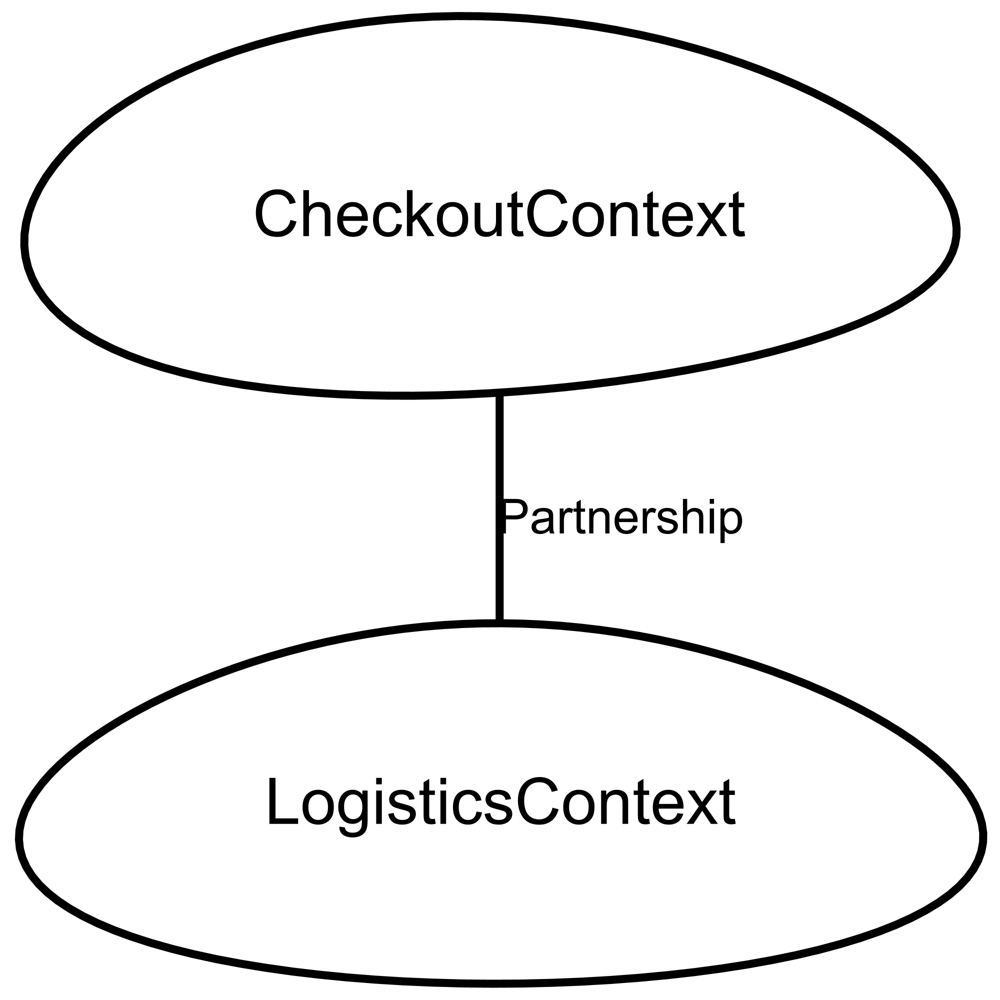
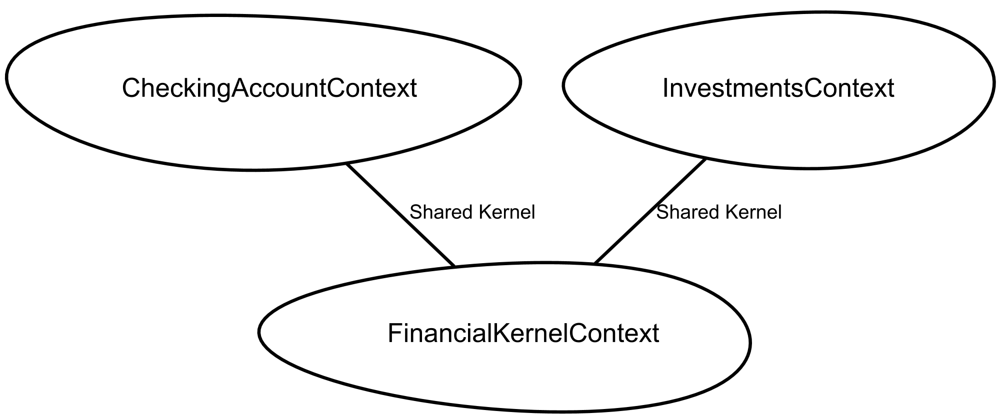

# ATIVIDADE: PARCERIA E NÚCLEO COMPARTILHADO(1)

### 1. Qual é a principal diferença entre os padrões Parceria e Núcleo Compartilhado?

A principal diferença reside no **nível de acoplamento e na forma de colaboração** entre as equipes:

* **Parceria (Partnership):** As duas equipes (ou contextos) dependem uma da outra para o sucesso. Elas coordenam seus planos de desenvolvimento e integração. Se uma equipe precisa de uma mudança, a outra se ajusta. Não há necessariamente um código compartilhado, mas sim uma cooperação estreita.
* **Núcleo Compartilhado (Shared Kernel):** Aqui, uma porção específica do modelo e do código (como uma biblioteca ou banco de dados) é compartilhada fisicamente. Ambas as equipes podem ler e modificar esse núcleo, mas qualquer alteração exige a anuência da outra equipe, pois quebra ambos os lados.

---

### 2. Em que situações você acha que seria benéfico usar ambos os padrões?

Embora raramente usados no mesmo exato ponto de integração, eles podem coexistir em sistemas complexos:

* **Sincronização de Roadmap:** Quando duas equipes já trabalham em regime de **Parceria** (alinhando objetivos de negócio), elas podem decidir que a forma mais eficiente de manter a integridade de um subdomínio comum é através de um **Núcleo Compartilhado**.
* **Transição de Monolitos:** Em processos de migração para microserviços, as equipes podem manter uma Parceria para evoluir o sistema enquanto compartilham um Núcleo (como o esquema de um banco de dados legado) temporariamente.

---

### 3. Quais são os benefícios e os riscos de combinar esses dois padrões?

| Aspecto | Benefícios | Riscos |
| --- | --- | --- |
| **Integração** | Reduz a duplicação de código e garante que conceitos vitais sejam idênticos em ambos os contextos. | **Acoplamento excessivo:** Uma mudança simples em um lado pode gerar um "efeito dominó" e paralisar a outra equipe. |
| **Comunicação** | Força uma comunicação clara e constante entre os stakeholders técnicos. | **Burocracia:** O processo de tomada de decisão pode ficar lento, pois tudo precisa ser validado por ambas as partes. |
| **Consistência** | Alinhamento total entre os objetivos de negócio e a implementação técnica. | **Rigidez:** O Núcleo Compartilhado tende a se tornar um "lixo" de funcionalidades que ninguém se sente confortável em limpar. |

---

### 4. Exemplos de projetos e contextos

* **Exemplo de Parceria (Partnership):**
> * *Contexto:* Uma plataforma de E-commerce onde a equipe de **Checkout** e a equipe de **Logística** precisam trabalhar juntas. Se o Checkout mudar a forma como calcula o frete, a Logística precisa estar pronta para processar esse dado. Eles não compartilham código, mas seus sucessos estão interligados.

ContextMap EcommercePartnershipMap {
    contains CheckoutContext
    contains LogisticsContext

    /* Relação de Parceria: Ambas as equipes cooperam estreitamente */
    CheckoutContext [P]<->[P] LogisticsContext
}

BoundedContext CheckoutContext {
    domainVisionStatement "Responsável pela finalização da compra e pagamentos."
}

BoundedContext LogisticsContext {
    domainVisionStatement "Responsável pelo cálculo de frete e despacho de mercadorias."
}

* **CONTEXT BOUNDED**

* **Exemplo de Núcleo Compartilhado (Shared Kernel):**
* *Contexto:* Um sistema bancário onde o contexto de **Investimentos** e o de **Conta Corrente** utilizam uma biblioteca comum de "Cálculos Financeiros e Moedas". Como a lógica de precisão decimal e arredondamento deve ser idêntica em todo o banco para evitar erros contábeis, o código é compartilhado e mantido rigidamente por ambos.

ContextMap BankingSharedKernelMap {
    contains InvestmentsContext
    contains CheckingAccountContext
    contains FinancialKernelContext // O contexto que representa o código compartilhado

    /* Ambos compartilham o mesmo subdomínio ou biblioteca técnica */
    InvestmentsContext [SK]<->[SK] FinancialKernelContext
    CheckingAccountContext [SK]<->[SK] FinancialKernelContext
}

BoundedContext InvestmentsContext {
    type FEATURE
}

BoundedContext CheckingAccountContext {
    type FEATURE
}

/* O Kernel geralmente contém Value Objects e tipos básicos */
BoundedContext FinancialKernelContext {
    type APPLICATION
    Module currency_utilities {
        Aggregate MoneyValueObject {
            Entity Money {
                double amount
                String currencyCode
            }
        }
    }
}

* **CONTEXT BOUNDED**

