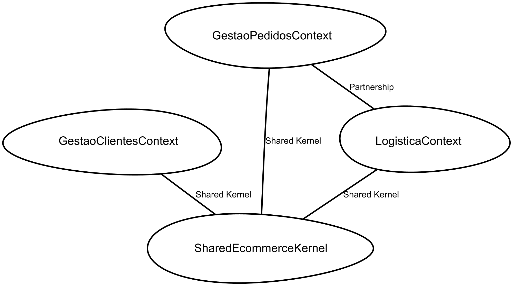
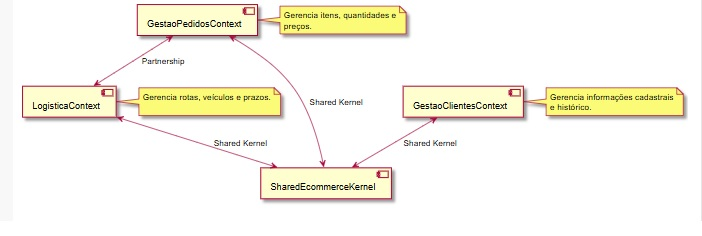

# ATIVIDADE: PARCERIA E NÚCLEO COMPARTILHADO(2)

## Atividade: Estudo de Caso - Pedidos, Logística e Clientes (Parte 2)

### Plano de Implementação:

1. **Parceria (Gestão de Pedidos ↔ Logística):** As equipes alinham o ciclo de vida do pedido (ex: o status "Pago" em Pedidos dispara a "Separação" em Logística).
2. **Núcleo Compartilhado (Shared Kernel):** Extração de objetos comuns como `Address`, `CustomerInfo` e `Dimensions` para uma biblioteca compartilhada.

```csharp
/* 4. Documentação do Plano via Context Map */
ContextMap EcommerceSystemMap {
    type SYSTEM_LANDSCAPE
    state AS_IS

    contains GestaoPedidosContext
    contains LogisticaContext
    contains GestaoClientesContext
    contains SharedEcommerceKernel

    /* Item 2: Parceria entre Pedidos e Logística */
    GestaoPedidosContext [P]<->[P] LogisticaContext

    /* Item 3: Núcleo Compartilhado para modelos comuns */
    GestaoPedidosContext [SK]<->[SK] SharedEcommerceKernel
    LogisticaContext [SK]<->[SK] SharedEcommerceKernel
    GestaoClientesContext [SK]<->[SK] SharedEcommerceKernel
}

BoundedContext GestaoPedidosContext {
    domainVisionStatement "Gerencia itens, quantidades e preços."
}

BoundedContext LogisticaContext {
    domainVisionStatement "Gerencia rotas, veículos e prazos."
}

BoundedContext GestaoClientesContext {
    domainVisionStatement "Gerencia informações cadastrais e histórico."
}

/* Definição do Subconjunto Comum (Item 3) */
BoundedContext SharedEcommerceKernel {
    Module common_models {
        Aggregate SharedEntities {
            ValueObject Address {
                String street
                String zipCode
                String city
            }
            ValueObject CustomerBasicInfo {
                Long customerId
                String name
            }
        }
    }
}
```



> **Diagrma UML**



### Pontos-Chave da Aplicação:

* **Sincronia de Status:** Através da **Parceria**, o contexto de Pedidos não "manda" na Logística, eles cooperam para que o fluxo de entrega seja fluido.
* **Integridade de Dados:** O **Shared Kernel** garante que o endereço de entrega capturado no Pedido seja interpretado exatamente da mesma forma pelo algoritmo de rotas da Logística, sem necessidade de mapeamentos complexos.

